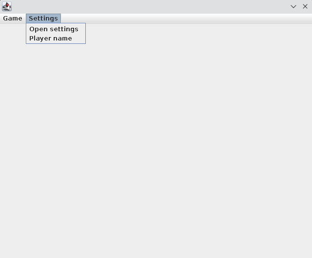

# Bomberman 
Az eredeti bomberman játék alapkoncepcióját utánzó programról van szó. A játékos egy véletlenszerűen generált pályán találja magát, ahol ellenségek és elpusztítható dobozok és falak találhatók. Lehet bombát is lehelyezni, ami pár másodperc után felrobban tüzet hagyva maga után. A tűz minden vele érintkező játékost, ellenséget és pusztítható dobozt elpusztít. A játék online játszható, így elérhető szervez üzemmódja is a programnak, amire több kliens is fel tud csatlakozni.

# Főképernyő


# Menük
## Játék műveletek

- Connect: Helyi vagy távoli szerverhez csatlakozás ip és port alapján


- Auto reconnect: nyerés, vesztés esetén automatikus visszacsatlakozást tesz lehetővé
- Disconnect: lecsatlakozás a szerverről

## Beállítások

- Open settings: OS natív alkalmazásával beállítások szerkesztése
- Player name: játék közben megjelenő név szerkesztése játékba csatlakozás előtt


# Játék közben

Mozgás:
- W: előre
- A: balra
- S: le
- D: jobbra

Space: bomba lehelyezés

# CLI paraméterek
`--server`: szerver módban indítás

`--client`: kliens mód indítás

`--server-port`: szerver portja amin keresztül lehet rá csatlakozni (default 32469)

`--config-file`: azon config file neve amit használni kell jelenleg (default config.json)

# Fejlesztőknek: config.json
```json
{
  "squaresize": 50, // egy blokk mérete
  "velocityPlayer": 6, // játékos sebessége
  "velocityEnemy": 1, // ellenség sebessége
  "windowHeight": 480, // ablak magasság
  "windowWidth": 640, // ablak szélesség
  "worldHeight": 9, // pálya magasság
  "worldWidth": 13, // pálya szélesség
  "boxRatio": 0.25, // dobozok esélye
  "enemyRatio": 0.05, // ellenségek esélye
  "enemyKeyChangePossibility": 0.0015, // ellenség irányváltás esély
  "tickRate": 17, // tick sebesség (ms)
  "authLength": 26, // autentikáció hossza
  "nameMaxLength": 15, // maximális név
  "bombCountStart": 1, // játékosonkénti bomba
  "spawnSquareDistanceFromOthers": 3, // táv másoktól pályára helyezéskor
  "spawnPlayerSquareFreeSpace": 3, // üres hely pályára helyezéskor
  "autoreconnect": false, // automatikus visszacsatlakozás
  "ip": "127.0.0.1", // legutóbbi ip
  "port": 32469, // legutóbbi port
  "name": "player", // legutóbbi játékosnév
  "debug": false // debug bekapcsolása
}
```